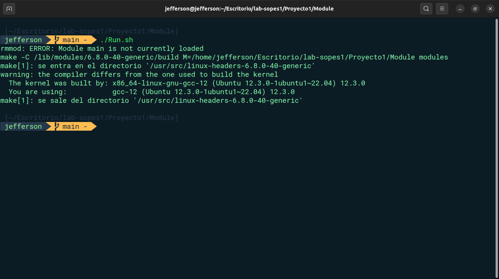

# **SISTEMAS OPERATIVOS 1**

<p>Brandon Andy Jefferson Tejaxún Pichiyá</p>
<p>202112030</p>

## :wrench: Herramientas:

<div align="center">
	<a href="#">
		
	</a>
</div>

## **Creación de Módulo de Kernel**

* Configuración
```c
MODULE_LICENSE("GPL");
MODULE_AUTHOR("Brandon Tejaxún");
MODULE_DESCRIPTION("Modulo para leer informacion de memoria y CPU en JSON");
MODULE_VERSION("1.0");
```

* Método Show Info

Kernel de Linux que genera un reporte con información sobre la memoria del sistema y los procesos relacionados con `containerd-shim`

```c
static int sysinfo_show(struct seq_file *m, void *v)
{
    struct sysinfo si;
    struct task_struct *task;
    struct task_struct *hijos;
    int first_process = 1;
    unsigned long total_jiffies = jiffies;

    // Obtener la información de memoria
    si_meminfo(&si);
    unsigned long totalram = si.totalram * (PAGE_SIZE / 1024); // Convertir páginas a KB
    unsigned long freeram = si.freeram * (PAGE_SIZE / 1024);   // Convertir páginas a KB
    unsigned long ram_usada = totalram - freeram;

    // Imprimir información de memoria
    seq_printf(m, "  {\n");
    seq_printf(m, "\"SystemInfo\": \n");
    seq_printf(m, "\t{\n");
    seq_printf(m, "\t\t\"Total_RAM\": %lu,\n", totalram);
    seq_printf(m, "\t\t\"Free_RAM\": %lu,\n", freeram);
    seq_printf(m, "\t\t\"Used_RAM\": %lu\n", ram_usada);
    seq_printf(m, "\t},\n");

    seq_printf(m, "\"Processes\": [\n");

    // Iterar sobre los procesos
    for_each_process(task)
    {
        if (strcmp(task->comm, "containerd-shim") == 0)
        {
            unsigned long vsz = 0;
            unsigned long rss = 0;
            unsigned long mem_usage = 0;
            unsigned long cpu_usage = 0;
            char *cmdline = NULL;
            
            list_for_each_entry(hijos, &task->children, sibling)
            {
                if (hijos->mm)
                {
                    // Obtener el uso de memoria virtual y física
                    vsz = hijos->mm->total_vm << (PAGE_SHIFT - 10); // Convertir a KB
                    rss = get_mm_rss(hijos->mm) << (PAGE_SHIFT - 10); // Convertir a KB
                    mem_usage = (rss * 10000) / totalram; // Porcentaje de memoria
                }

                // Obtener el tiempo total de CPU
                unsigned long total_time = (task->utime + task->stime) + (hijos->utime + hijos->stime);
                cpu_usage = (total_time * 10000) / (total_jiffies * HZ); // Porcentaje de CPU

                cmdline = get_process_cmdline(task);

                if (!first_process)
                {
                    seq_printf(m, ",\n");
                }
                else
                {
                    first_process = 0;
                }

                seq_printf(m, "\t{\n");
                seq_printf(m, "\t\t\"PID\": %d,\n", task->pid);
                seq_printf(m, "\t\t\"Name\": \"%s\",\n", task->comm);
                seq_printf(m, "\t\t\"Cmdline\": \"%s\",\n", cmdline ? cmdline : "N/A");
                seq_printf(m, "\t\t\"MemoryUsage\": %lu.%02lu,\n", mem_usage / 100, mem_usage % 100);
                seq_printf(m, "\t\t\"CPUUsage\": %lu.%02lu\n", cpu_usage / 100, cpu_usage % 100);
                seq_printf(m, "\t}");

                if (cmdline)
                {
                    kfree(cmdline);
                }
            }
        }
    }

    seq_printf(m, "\n]\n}\n");
    return 0;
}

```

* Script de Ejecución

Elimina el módulo en caso de que exista, luego lo crea

```bash
# ELIMINAR MÓDULO
sudo rmmod main.ko
make
# AGREGAR EL MÓDULO
sudo insmod main.ko
```

* Ejecución

<div align="center">
    
</div>

## **Servicio de Python**

* API - FastApi

El servicio de python es el encargado de registrar los logs en el archivo json que posteriormente serán utilizados para generar las gráficas de consumo de memoria y cpu

```py
@app.post("/logs")
def get_logs(logs_proc: List[LogProcess]):
    logs_file = 'logs/logs.json'
    
    # Checamos si existe el archivo logs.json
    if os.path.exists(logs_file):
        # Leemos el archivo logs.json
        with open(logs_file, 'r') as file:
            existing_logs = json.load(file)
    else:
        # Sino existe, creamos una lista vacía
        existing_logs = []

    # Agregamos los nuevos logs a la lista existente
    new_logs = [log.dict() for log in logs_proc]
    existing_logs.extend(new_logs)

    # Escribimos la lista de logs en el archivo logs.json
    with open(logs_file, 'w') as file:
        json.dump(existing_logs, file, indent=4)

    return {"received": True}

@app.post("/close")
async def generate_charts():
    logs_file = 'logs/logs.json'

    if not os.path.exists(logs_file):
        return {"error": "No data available to generate charts."}

    # Leer datos del archivo JSON
    with open(logs_file, 'r') as file:
        data = json.load(file)

    plt.style.use('dark_background')
    # Manejar posibles claves faltantes
    timestamps = [entry.get('timestamp', '') for entry in data]
    memory_usage = [entry.get('memory_usage', 0.0) * 100 for entry in data] # Convertir a porcentaje
    cpu_usage = [entry.get('cpu_usage', 0.0) * 100 for entry in data]       # Convertir a porcentaje
    container_ids = [entry.get('container_id', '')[:4] for entry in data]   # Extraer solo los primeros 4 dígitos del container_id

    # Gráfica de Memory Usage
    plt.figure(figsize=(12, 6))
    plt.step(timestamps, memory_usage, color='#FABC3F', linewidth=2.5, where='mid')
    plt.fill_between(timestamps, memory_usage, step="mid", alpha=0.4, color='#FABC3F')
    plt.xlabel('Container ID')
    plt.ylabel('Memory Usage (%)')
    plt.title('Memory Usage Over Time', fontsize=14)
    plt.xticks(ticks=np.arange(len(container_ids)), labels=container_ids, rotation=90, fontsize=8, color='white')
    plt.ylim(0, 100)
    plt.yticks(np.arange(0, 101, 10), color='white')
    plt.grid(True, linestyle='--', alpha=0.5)
    plt.tight_layout()

    try:
        plt.savefig('/code/imgs/memory_usage.png')
        print("Memory usage chart saved successfully.")
    except Exception as e:
        print(f"Failed to save memory usage chart: {e}")

    plt.close()

    # Gráfica de CPU Usage
    plt.figure(figsize=(12, 6))
    plt.step(timestamps, cpu_usage, color='#3FA2F6', linewidth=2.5, where='mid')
    plt.fill_between(timestamps, cpu_usage, step="mid", alpha=0.4, color='#3FA2F6')
    plt.xlabel('Container ID')
    plt.ylabel('CPU Usage (%)')
    plt.title('CPU Usage Over Time', fontsize=14)
    plt.xticks(ticks=np.arange(len(container_ids)), labels=container_ids, rotation=90, fontsize=8, color='white')
    plt.ylim(0, 100)
    plt.yticks(np.arange(0, 101, 10), color='white')
    plt.grid(True, linestyle='--', alpha=0.5)
    plt.tight_layout()

    try:
        plt.savefig('/code/imgs/cpu_usage.png')
        print("CPU usage chart saved successfully.")
    except Exception as e:
        print(f"Failed to save CPU usage chart: {e}")

    plt.close()

    return {"message": "Charts generated successfully."}
```

* Ejecución

<div align="center">
    
</div>

## **Contenedores de Alto y Bajo Consumo**

Son utilizados para poder analizarlos con servicios que se detallan más adelante.

### Alto Consumo

```py
# high_cpu.py
while True:
    # Realizar cálculos para consumir CPU
    x = 0
    for i in range(1000000):
        x += i
```

```dockerfile
FROM python:3-alpine
COPY . .
WORKDIR /

CMD [ "ash", "-c", "python high-cpu.py" ]
```

### Bajo Consumo

```py
# low_cpu.py
import time

while True:
    # Dormir por 1 segundo para reducir el consumo de CPU
    time.sleep(1)
```

```dockerfile
FROM python:3-alpine
COPY . .
WORKDIR /

CMD [ "ash", "-c", "python low-cpu.py" ]
```

## **Cronjob**

* Script Cronjob

Se encarga de verificar si existen las imágenes de Docker especificadas y las construye. Luego, elimina todos los contenedores en ejecución excepto uno llamado `log_container`. Posteriormente, selecciona aleatoriamente una de las imágenes y crea 10 contenedores con nombres generados al azar usando las imágenes creadas anteriormente.

```bash
#!/bin/bash

# Verificar y construir las imágenes solo si no existen
if [ -z "$(docker images -q high-cpu-image)" ]; then
    docker build -t high-cpu-image ./High-cpu/
fi

if [ -z "$(docker images -q low-cpu-image)" ]; then
    docker build -t low-cpu-image ./Low-cpu/
fi

if [ -z "$(docker images -q high-ram-image)" ]; then
    docker build -t high-ram-image ./High-ram/
fi

if [ -z "$(docker images -q low-ram-image)" ]; then
    docker build -t low-ram-image ./Low-ram/
fi

# Eliminar todos los contenedores existentes excepto el contenedor de Docker Compose
if [ "$(docker ps -a -q)" ]; then
    # Lista todos los contenedores excepto el contenedor 'log_container'
    containers_to_remove=$(docker ps -a -q | grep -v $(docker ps -a -q -f name=log_container))
    if [ -n "$containers_to_remove" ]; then
        docker rm -f $containers_to_remove
    fi
fi

# Array de imágenes
images=("high-ram-image" "high-cpu-image" "low-ram-image" "low-cpu-image")

# Crear 10 contenedores aleatorios
for i in {1..10}
do
    # Seleccionar una imagen aleatoriamente
    image=${images[$RANDOM % ${#images[@]}]}

    # Generar un nombre aleatorio para el contenedor
    container_name=$(head /dev/urandom | tr -dc A-Za-z0-9 | head -c 13)

    # Ejecutar el contenedor
    docker run -d --name $container_name $image
done
```

* Creación del Cronjob

Se encarga de agregar los cronjobs al crontab del usuario. Añade nuevos cronjobs cada minuto

```bash
#!/bin/bash

# Ruta al archivo de cronjobs temporales
TEMP_CRON="/tmp/mycron"

# Obtener los cronjobs existentes y guardarlos en un archivo temporal
crontab -l > $TEMP_CRON

# Agregar el nuevo cronjob (reemplaza la ruta del script y el intervalo según sea necesario)
echo "* * * * * /home/jefferson/Escritorio/lab-sopes1/Proyecto1/Docker/Cronjob.sh" >> $TEMP_CRON
echo "* * * * * sleep 30; /home/jefferson/Escritorio/lab-sopes1/Proyecto1/Docker/Cronjob.sh" >> $TEMP_CRON

# Aplicar el archivo temporal al crontab
crontab $TEMP_CRON

# Limpiar el archivo temporal
rm $TEMP_CRON

echo "Cronjob añadido con éxito."
```

## **Servicio Rust**

Rust monitorea el uso de CPU y memoria de los procesos del sistema, clasfica los procesos en grupos de bajo y alto consumo, y detiene contenedores docker de bajo rendimiento. Utiliza la biblioteca tokio para manejar señales asíncronas y reqwest para enviar registros y solicitudes HTTP al servicio de python para poder registrar logs y generar las gráficas de rendimiento.

```rust
async fn analyzer(system_info: SystemInfo) {
    let mut log_proc_list: Vec<LogProcess> = Vec::new();
    let mut processes_list: Vec<Process> = system_info.processes;

    processes_list.sort();
    let (lowest_list, highest_list) = processes_list.split_at(processes_list.len() / 2);

    let container_id = get_docker_container_id();

    // Datos para las columnas
    let headers = ["PID", "Name", "Container ID", "Memory Usage", "CPU Usage"];

    // Función para calcular el ancho máximo de cada columna
    fn calculate_column_widths(processes: &[Process], headers: &[&str]) -> Vec<usize> {
        let mut widths = headers.iter().map(|h| h.len()).collect::<Vec<_>>();
        
        for process in processes {
            widths[0] = widths[0].max(process.pid.to_string().len()); // PID
            widths[1] = widths[1].max(process.name.len());             // Name
            widths[2] = widths[2].max(process.get_container_id().len()); // Container ID
            widths[3] = widths[3].max(process.memory_usage.to_string().len()); // Memory Usage
            widths[4] = widths[4].max(process.cpu_usage.to_string().len());    // CPU Usage
        }
        widths
    }

    // Calcular el ancho de las columnas basado en el contenido de procesos
    let column_widths = calculate_column_widths(&processes_list, &headers);

    // Calcular el ancho total de la tabla
    let total_width = column_widths.iter().sum::<usize>() + column_widths.len() * 3 + 1; // +3 por los separadores y padding

    // Función para generar una línea de separación para las tablas
    fn print_separator(column_widths: &[usize], left: char, mid: char, right: char) {
        print!("{}", left);
        for (i, width) in column_widths.iter().enumerate() {
            print!("{}", "═".repeat(*width + 2)); // +2 para el padding
            if i < column_widths.len() - 1 {
                print!("{}", mid);
            }
        }
        println!("{}", right);
    }

    // Función para imprimir los encabezados o filas de la tabla
    fn print_row(values: &[&str], column_widths: &[usize]) {
        print!("║");
        for (value, width) in values.iter().zip(column_widths.iter()) {
            print!(" {:^width$} ║", value, width = *width);
        }
        println!();
    }

    // Sección Bajo Consumo
    println!("╔{:═^width$}╗", " Bajo Consumo ", width = total_width - 2); // -2 para los bordes
    print_separator(&column_widths, '╠', '╦', '╣');

    print_row(&headers, &column_widths);
    print_separator(&column_widths, '╠', '╬', '╣');

    for process in lowest_list {
        print_row(&[
            &process.pid.to_string(),
            &process.name,
            &process.get_container_id(),
            &process.memory_usage.to_string(),
            &process.cpu_usage.to_string(),
        ], &column_widths);
    }
    print_separator(&column_widths, '╚', '╩', '╝');

    // Sección Alto Consumo
    println!();
    
    println!("╔{:═^width$}╗", " Alto Consumo ", width = total_width - 2); // -2 para los bordes
    print_separator(&column_widths, '╠', '╦', '╣');

    print_row(&headers, &column_widths);
    print_separator(&column_widths, '╠', '╬', '╣');

    for process in highest_list {
        print_row(&[
            &process.pid.to_string(),
            &process.name,
            &process.get_container_id(),
            &process.memory_usage.to_string(),
            &process.cpu_usage.to_string(),
        ], &column_widths);
    }
    print_separator(&column_widths, '╚', '╩', '╝');

    // Proceso de matado de contenedores
    if lowest_list.len() > 3 {
        for process in lowest_list.iter().skip(3) {
            if container_id != process.get_container_id() {
                let log_process = LogProcess {
                    pid: process.pid,
                    container_id: process.get_container_id().to_string(),
                    name: process.name.clone(),
                    memory_usage: process.memory_usage,
                    cpu_usage: process.cpu_usage,
                };
    
                log_proc_list.push(log_process.clone());
    
                // Matamos el contenedor.
                let _output = kill_container(&process.get_container_id());
            }
        }
    }

    if highest_list.len() > 2 {
        for process in highest_list.iter().take(highest_list.len() - 2) {
            if container_id != process.get_container_id() {
                let log_process = LogProcess {
                    pid: process.pid,
                    container_id: process.get_container_id().to_string(),
                    name: process.name.clone(),
                    memory_usage: process.memory_usage,
                    cpu_usage: process.cpu_usage
                };
                log_proc_list.push(log_process.clone());
                let _output = kill_container(&process.get_container_id());
            }
        }
    }

    // Convertir LogProcess a LogData
    let log_data_list: Vec<LogData> = log_proc_list.iter().map(|log| LogData {
        pid: log.pid,
        container_id: log.container_id.clone(),
        name: log.name.clone(),
        vsz: 0,
        rss: 0,
        memory_usage: log.memory_usage,
        cpu_usage: log.cpu_usage,
        action: "stopped".to_string(),
        timestamp: chrono::Utc::now().to_rfc3339(),
    }).collect();

    // Enviar los datos a la API
    if let Err(e) = send_logs_to_api(&log_data_list).await {
        eprintln!("Error sending logs: {}", e);
    }
}
```

* Ejecución

Al presionar la combinación de teclas `ctrl + c`, se detiene la ejecución y genera las gráficas de rendimiento.

<div align="center">
    
</div>

## **Gráficas de Consumo de CPU y Memoria**

<div align="center">
    
    
</div>
