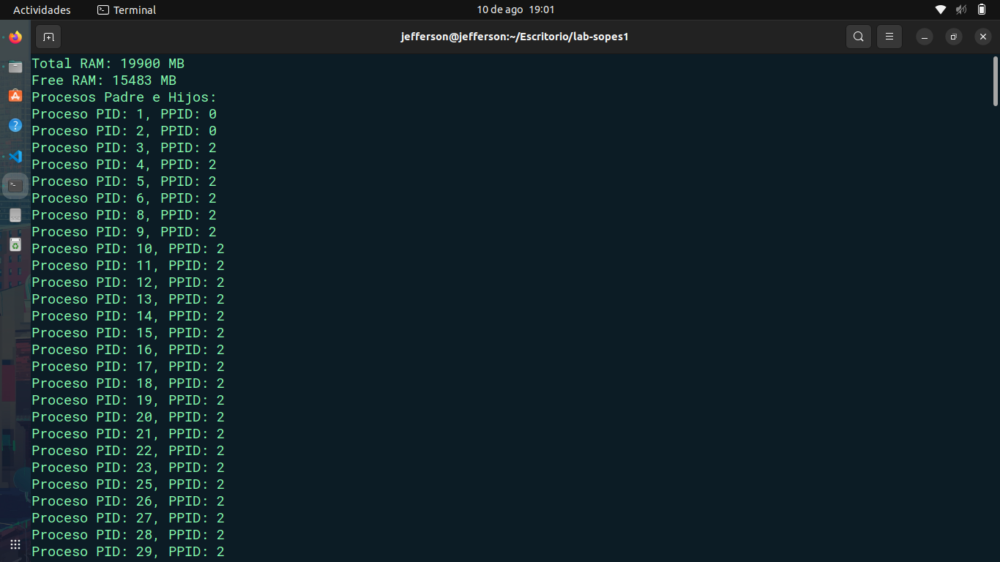

# **SISTEMAS OPERATIVOS 1**

<p>Brandon Andy Jefferson Tejaxún Pichiyá</p>
<p>202112030</p>

## :wrench: Herramientas:

<div align="center">
	<a href="#">
		
	</a>
</div>

```
#include <stdio.h>
#include <stdlib.h>
#include <sys/sysinfo.h>
#include <dirent.h>
#include <string.h>
#include <unistd.h>
#include <ctype.h>

// Función para obtener la información de la memoria
void obtener_memoria() {
    struct sysinfo si;
    if (sysinfo(&si) == 0) {
        printf("Total RAM: %lu MB\n", si.totalram / (1024 * 1024));
        printf("Free RAM: %lu MB\n", si.freeram / (1024 * 1024));
    } else {
        perror("sysinfo");
    }
}

// Función para verificar si un directorio es un proceso
int es_proceso(const struct dirent *entry) {
    if (entry->d_type == DT_DIR) {
        for (int i = 0; entry->d_name[i] != '\0'; i++) {
            if (!isdigit(entry->d_name[i])) {
                return 0;
            }
        }
        return 1;
    }
    return 0;
}

// Función para listar los procesos padre e hijos
void listar_procesos() {
    DIR *dir;
    struct dirent *entry;
    char path[1024], line[256];
    FILE *fp;

    if ((dir = opendir("/proc")) == NULL) {
        perror("opendir");
        return;
    }

    printf("Procesos Padre e Hijos:\n");
    while ((entry = readdir(dir)) != NULL) {
        if (es_proceso(entry)) {
            snprintf(path, sizeof(path), "/proc/%s/status", entry->d_name);
            if ((fp = fopen(path, "r")) != NULL) {
                int ppid = 0, pid = atoi(entry->d_name);
                while (fgets(line, sizeof(line), fp)) {
                    if (strncmp(line, "PPid:", 5) == 0) {
                        sscanf(line, "PPid: %d", &ppid);
                        break;
                    }
                }
                fclose(fp);

                // Imprimir información del proceso padre e hijo
                printf("Proceso PID: %d, PPID: %d\n", pid, ppid);
            }
        }
    }

    closedir(dir);
}

int main() {
    obtener_memoria();
    listar_procesos();
    return 0;
}

```

Ejecución 
