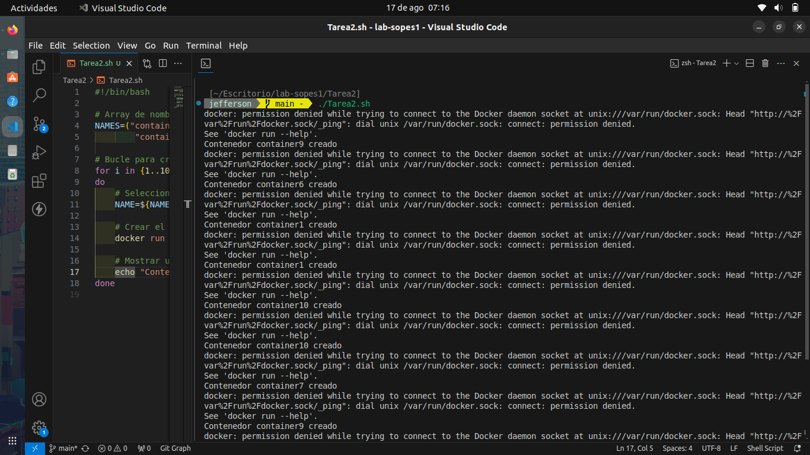

# **SISTEMAS OPERATIVOS 1**

<p>Brandon Andy Jefferson Tejaxún Pichiyá</p>
<p>202112030</p>

## :wrench: Herramientas:

<div align="center">
	<a href="#">
		
	</a>
</div>

``` bash
NAMES=("container1" "container2" "container3" "container4" "container5"
        "container6" "container7" "container8" "container9" "container10")

for i in {1..10}
do
    NAME=${NAMES[$RANDOM % ${#NAMES[@]}]}

    # Crear el contenedor usando la imagen alpine
    docker run -d --name $NAME alpine sleep 3600

    echo "Contenedor $NAME creado"
done
```

Ejecución 
